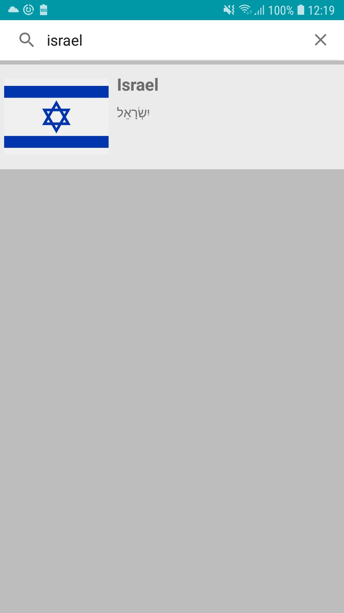

This app lists all the countries around the world.
By clicking on one of the countries, the location of the country will be presented on the map following
a list of the neighboring countries.
By clicking on one of the neighboring countries, the map will automatically move to its location and adjust the zoom level according to the size.

I used retrofit to pull the data from https://restcountries.eu/
GlideToVectorYou for the flags
google map

